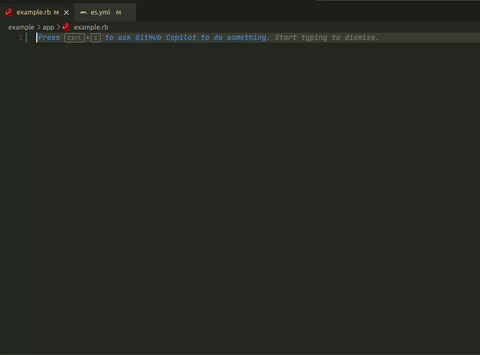

# RubyLspI18n

The `ruby-lsp-i18n` gem provides internationalization support for Ruby Lsp.

## Installation

Add to the following line to your application's development Gemfile:

```ruby
gem 'ruby-lsp-i18n', git: 'https://github.com/bukhr/ruby-lsp-i18n', require: false
```

Then run the following command to install the gem:

```bash
bundle install
```

## Features

- Inlay Hints for translations
  - Show value as inlay hint for translation keys
  - Hover with the translation value
  - Hover with the file path of the translation

- Autocompletion for translation keys
- Synchronization of yml translation files



### Configuration

The addon is enabled by default but can be disabled using the .vscode/settings.json file in your project.

```json
{
  "rubyLsp.addonSettings": {
    "Ruby LSP I18n": {
        "enabled": false
    }
  }
}
```

## Development

1. Clone the repository
2. Install dependencies with `bundle install`
3. Run the tests with `bundle exec rake test`
4. Check types with `bundle exec srb tc`
5. Run the linter with `bundle exec rubocop`
6. Make a PR and wait for aproval
7. Merge the PR

To install this gem onto your local machine, run `bundle exec rake install`.

### Updating Ruby LSP

It is important to maintain this gem up to date with the latest version of Ruby Lsp. So the users of the gem have the updated features of the core LSP. To do so update the Ruby LSP version in the `ruby-lsp-i18n.gemspec` file. Then run the tests and make sure everything is working as expected.


## Contributing

Bug reports and pull requests are welcome on GitHub at <https://github.com/bukhr/ruby-lsp-i18n>. This project is intended to be a safe, welcoming space for collaboration, and contributors are expected to adhere to the [code of conduct](https://github.com/bukhr/ruby-lsp-i18n/blob/master/CODE_OF_CONDUCT.md).


## License

The gem is available as open source under the terms of the [MIT License](https://opensource.org/licenses/MIT).

## Code of Conduct

Everyone interacting in the RubyLspI18n project's codebases, issue trackers, chat rooms and mailing lists is expected to follow the [code of conduct](https://github.com/bukhr/ruby-lsp-i18n/blob/master/CODE_OF_CONDUCT.md).
